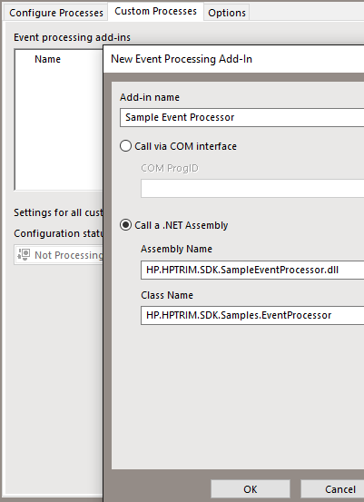

# Custom EventProcessor
The Event Processor runs along-side the work group server and process events such as content indexing, audit logging, mail notifications and many others.  A custom event processor allows for custom event to be processed on the server along with these stock events.

## Custom events versus a .Net addin
The most obvious differences between an add-in and a custom event is that the add-in runs in real time on the client machine and the custom event runs on the server when the event processor gets to it.  Custom events may interact with a host of different event types, unlike the add-in which fires on save and delete, for example a custom event may fire whenever a document is viewed.

## Setup the custom event
To enable the custom event
 - build the project,
 - copy HP.HPTRIM.SDK.SampleEventProcessor.dll to your EXE folder (where TRIMWorkgroup.exe is located),
 - open Enterprise Studio,
 - from your dataset select 'Event Processing > Configure',
 - go to the 'Custom Processes' tab,
 - add you DLL to look like the one in Image 1 (Add-in name can be anything),
 - use the 'Test' button to make sure your add-in can be found then
 - ensure your add-in is enabled on the approprite workgroup server (see Image 2).
 

### Image 1

### Image 2
