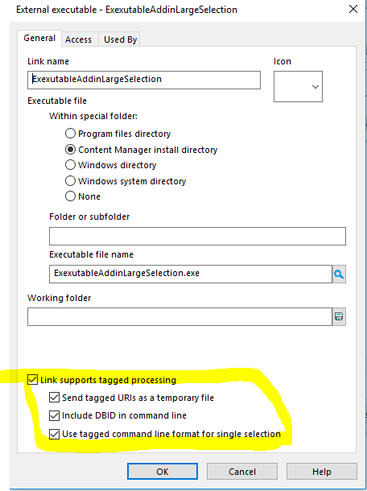

# Executable Addin
The executuable addin uses command line arguments to get the database ID and selected URIs.  If you include the database ID (see below) the paramters will be in this format: ```--dbid J1 --uris 9000000001,9000000002```

## Warning
As the URIS are passed as a comma separated string there is a limit on the number that will be passed.   If you require the executable add-in to support large numbers of selected records then CM 9.4 has an option to 'send tagged URIs as a temporary file.  This sample uses command line arguments to get the database ID and selected URIs.  If you include the database ID (see below) the paramters will be in this format: ```--dbid J1 --uris c:\Users\USER\AppData\Local\Micro Focus\Content Manager\TEMP\HPTRIM.340064\t0001CR5.txt```

## Rationale
One reason to use the executable over a .Net DLL is that you can store the executable once on a shared drive and have all users access the same instance remotely.  In general the .Net addin provides better functionality.

## Points of interest
This is a very simple sample.  The points of interest are:
 - the console parameters are retrieved in App.cs, which also loads MainWindow
 - prefer 32 bit has been de-selected, you may need to change this if you are running 32 bit
 
## Example configuration screen


## Example configuration screen using temp file
