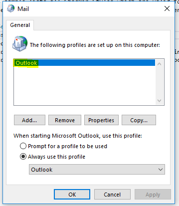

# Linked folder generator
This sample lists all Checkin Styles which are valid for use in Outlook but do not have an Outlook folder linked to them.  It will then create a linked folder for each of the Checkin Styles.  It is most useful when a number of Checkin Styles have been assigned to groups of which the user is a member.

## Setup
To use this sample:
 - find the name of your Outlook mail profile (see images below)
 - run the program
 - enter the Outlook Profile name, your email address and password
 - select the Checkin Styles for which you desire to create linked olders

## Authentication ##
This sample assumes you are able to use either integrated authentication or your SMTP address as your name/domain.  If you need to use the format domain\name then two extra fields will be require to enter these and the domain and name will need to be passwed in the constrcutor for WebCredentials.

 
  