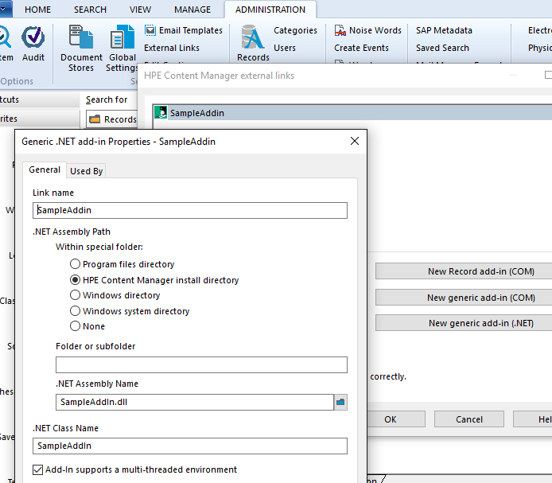
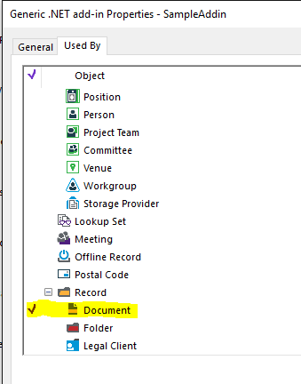

# Sample Addin
A .Net add-in can be used to customise the behaviour of various objects, such as Record, Location and others.  It allows you to intercept various events including:
 - PreDelete
 - Delete
 - PreSave
 - Save
 - and others...

In addition to intercepting events it can be used to add items to the context menu, in the 'Send To' sub menu

## Setup
To use this sample:
 - build then copy SampleAddin.dll to your EXE directory (the directory where trim.exe resides),
 - in the native client go to Administration > External Links,
 - add a 'New generic add-in (.Net) (see image 1),
 - select which object types this addin should be used by

## Testing
This addin will write a log file when it is used, to open the log file go to your AuditLogs folder (typicall ServerData\[DATABASE ID]\AuditLogs).  If the addin is operating then then from the context menu of an object select 'Send To > Sample Menu String

### Image 1

### Image 2

