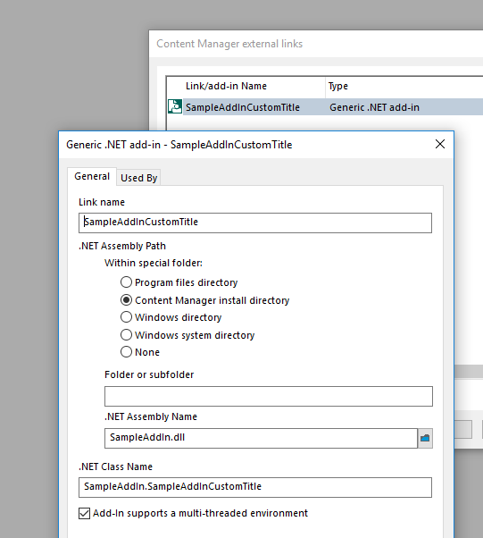

# Sample Addin to replace tags with Record properties
This add-in will read the title string and replace any properties surrounded with angle brackets with their equivalent property or field value.  For example the title "this is a record by <Author>" will be replaced by "this is a record by David".

# Finding the property Ids
This [table](https://content-manager-sdk.github.io/Community/93/namespace_h_p_1_1_h_p_t_r_i_m_1_1_s_d_k.html#a42b30f289efa9bf64150279dbb479586) lists all the properties, scroll down to find the ones that start with 'Record' (the first one is RecordAccessControl), the first column is the Id that should be used inside the angle brackets (e.g. &lt;Author> will be replaced with the Record Author property).

## Setup
To use this sample:
 - build then copy SampleAddin.dll to your EXE directory (the directory where trim.exe resides),
 - in the native client go to Administration > External Links,
 - add a 'New generic add-in (.Net) (see image 1),
 - select which object types this addin should be used by

## Download
If you want to download the add-in 'as-is' then you can do that [here](DLL).

### Image 1

### Image 2

