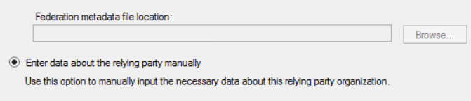
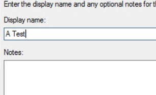
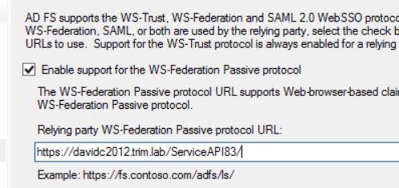

# ServiceAPI ADFS OAuth Client
This sample authenticates the user with the ADFS server and then passes that authentication via a bearer token to the ServiceAPI. 

## Versions
This sample should work with version 8.3 and later.

## Questions
Post any questions regarding this sample in the [SDK support forum](https://community.hpe.com/t5/SDK-API-Support/bd-p/sws-RM_SDKAPI).

## Sample application Setup
This sample application requires that:
* an ADFS relying party trust be configured,
* an ADFS client be created for the relying party trust, and that
* the ServiceAPI be configured to use ADFS for authentication.
These steps are described later in this document.  Once this has been done you should update the App.config of this sample application and:
* set your ADFS server URL in ida:authority,
* include the same URL used in the relying party trust in ida:resourceUri,
* put the guid you used when running Add-ADFSClient in ida:clientId, and
+ put the URL of your ServiceAPI instance in trim:ServiceLocation

## ServiceAPI Setup
To configure the ServiceAPI to use ADFS OAuth:

### Allow anonymous access in the IIS
IIS will not be handling authentication so we use IIS Manager to allow anonymous access only.


### Prevent anonymous access via the web.config
We need to force the ServiceAPI to require authentication, this is done by adding the authorization section to &lt;system.web/> in the ServiceAPI web.config.

```
    <authorization>
      <allow users="?" />
    </authorization>
```

### Configure ADFS in hptrim.config
In hptrim.config add an authentication section like the one below, ensure they metadataEndpoint points to your ADFS server and the audience matches the identifier in your Relying Party Trust exactly.
```
<authentication allowAnonymous="false">
  <activeDirectory>
    <add 
         name="adfs" 
         audience="https://davidc2012.trim.lab/ServiceAPI83/" 
         metadataEndpoint="https://adfs1.testteam.local/FederationMetadata/2007-06/FederationMetadata.xml"/>
  </activeDirectory>
</authentication>
```

## ADFS Setup
This document describes a simple ADFS Relying Party Trust configuration, depending on your needs you may configure something more sophisticated.

### Create the Relying Party Trust
From the ADFS Management Console create a new Relying Party Trust, for all screens not described below select 'Start' or 'Next'

#### Enter the metadata manually


#### Choose a name


#### Support WS-FederationMetadata


#### Add a claim rule
A simple approach is to use a custom rule to return all claims using the custom rule below:
```
c:[]
 => issue(claim = c);
```

#### Create ADFS Client
On the ADFS server use Powershell to create an ADFS client.  You will need to generate your own unique GUID, for example:
```
 Add-ADFSClient -Name "TestSAPIClient" -ClientId "P2CF1107-FF90-4228-93BF-26052DD2C714" -RedirectUri "https://davidc2012.trim.lab/ServiceAPI83/"
```
