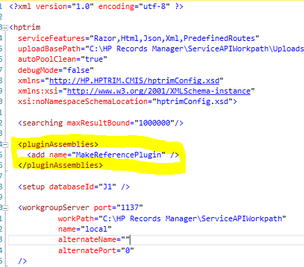

# MakeReference ServiceAPI Plugin
This sample adds a new service to the ServiceAPI to download a TR5 reference file which maybe used to open a Record (or other object type) in the native client.

## Setup
To use this sample:
 - Copy these files from your ServiceAPI bin folder to the Samples\ServiceAPI\CSharp\lib folder
    - HP.HPTRIM.SDK.dll
	- HP.HPTRIM.ServiceAPI.Client.dll
	- HP.HPTRIM.ServiceAPI.Common.dll
	- HP.HPTRIM.ServiceAPI.Model.dll
	- ServiceStack.Client.dll
	- ServiceStack.dll
	- ServiceStack.Interfaces.dll
	- ServiceStack.Text.dll
 - build the MakeReferencePlugin project
 - copy MakeReferencePlugin.dll to your ServiceAPI bin folder
 - add the XML below to the hptrim.config file in your ServiceAPI folder

 
## Plugin Configuration
The following XML must be copied as a child of the hptrim element of hptrim.config

```
  <pluginAssemblies>
    <add name="MakeReferencePlugin" />
  </pluginAssemblies>
```  

### Example




