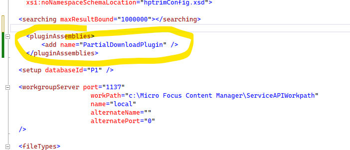

# Partial Download ServiceAPI Plugin
This sample adds a new service to the ServiceAPI to support resumable file downloads.

## Background
In Content Manager versions up to 10.1 partial downloads are not supported by the standard file dowbload URL (e.g. Record/[Uri]/document/file), this sample adds a new service to support this.

Partial downloads are implemented using Content-Range header.

## Setup
To use this sample:
 - Copy these files from your ServiceAPI bin folder to the Samples\ServiceAPI\CSharp\lib folder
    - TRIM.SDK.dll
	- TRIMServiceAPICommon.dll
	- TRIMServiceAPIModel.dll
	- ServiceStack.Client.dll
	- ServiceStack.dll
	- ServiceStack.Interfaces.dll
	- ServiceStack.Text.dll
 - build the PartialDownloadPlugin project
 - copy PartialDownloadPlugin.dll to your ServiceAPI bin folder
 - add the XML below to the hptrim.config file in your ServiceAPI folder

## NOTE for Content Manager 9.x users
This sample has been built against Content Manager 10.1 but will work against 9/x if you use the 9.x version of the Content Manager DLLs, which are""
 - HP.HPTRIM.SDK.dll
 - HP.HPTRIM.Service.dll
 - HP.HPTRIM.ServiceModel.dll

 
## Plugin Configuration
The following XML must be copied as a child of the hptrim element of hptrim.config

```
  <pluginAssemblies>
    <add name="PartialDownloadPlugin" />
  </pluginAssemblies>
```  

### Example




## Usage
Once the plugin is installed you should be able to download a file using a URL similar to this:

```
http://localhost/CMServiceAPI/PartialDownload/D16/1
```