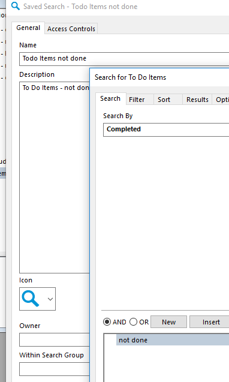
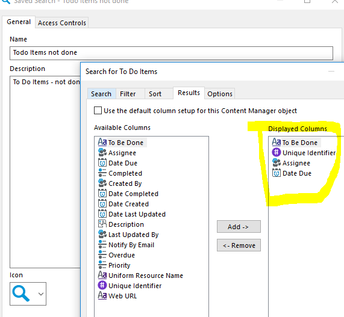
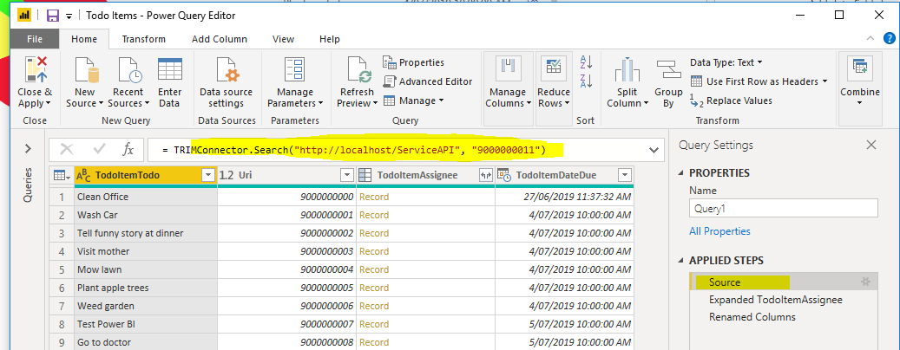
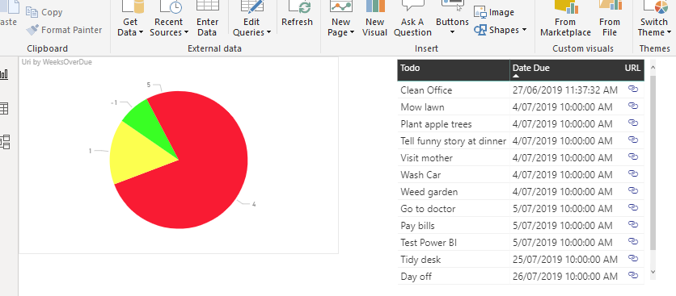

# Power BI Todo Item Sample
This pbix file is a sample Power BI report showing To do Items not completed by person.  Techniques similar to those used in this sample could be used for other visualizations, such as:
 * all Records created this week by Record Type
 * Records checked out to me by weeks checked out
 * Activites Due my action
 * Records due for deletion
 * Audit events by type

## Instructions
To use this sample:
 1. in CM create a Todo Item saved search of items not completed (see image 1),
 2. select the columns To Be Done, Uri, Assignee, and Date Due (see image 2),
 3. download and open the PBIX file and 'Edit Queries'
 4. change the URL and saved search Uri (or name) in the source (see image 3), then
 5. assuming you have some incomplete To Do Items you should see something like image 4.
 
## Things to look for
Things to take note of in this sample:
 * a Pie chart does not support [conditional formatting](https://docs.microsoft.com/en-us/power-bi/visuals/service-tips-and-tricks-for-color-formatting) of Data Colors, to see the formatting:
     * switch the pie chart to a bar chart
	 * in Data Colors select 'Conditional Formatting' from the ellipsis menu
	 * note the color comes from the computed column ColorPriority
 * the URL is based on a [computed column](https://docs.microsoft.com/en-us/power-bi/power-bi-hyperlinks-in-tables) in the data	 
 * Todo items can be filtered based on the Assignee using [row level security](https://docs.microsoft.com/en-us/power-bi/service-admin-rls)
 * reports like this can be [published](https://docs.microsoft.com/en-us/power-bi/desktop-upload-desktop-files) to Power BI in the cloud and connected to CM on-premise using a [gateway](https://docs.microsoft.com/en-us/power-bi/service-gateway-onprem)
 
## Images
### Image 1

### Image 2

### Image 3

### Image 4

