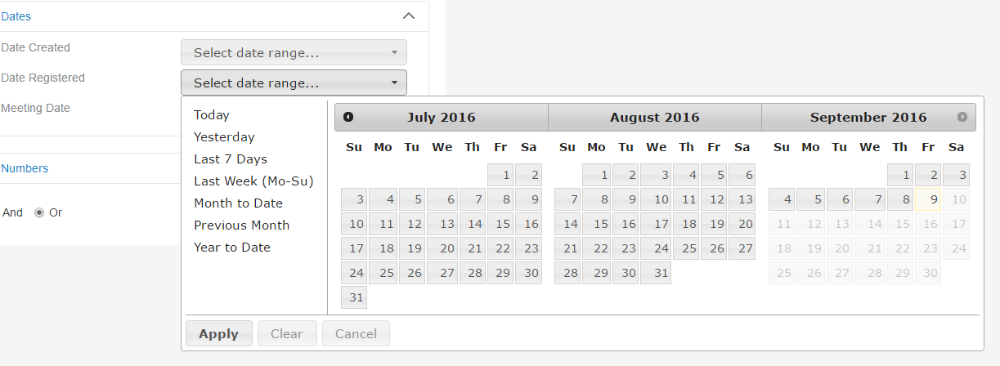
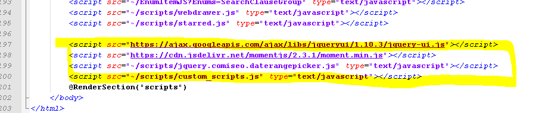

# Date Range Selector for WebDrawer

## Overview
Dates in HPE CM may be specified in a number of ways, using standard date formats but also using special strings like 'today', 'yesterday', or 'this year'.  Both for this reason and also because WebDrawer is designed to have a simple user interface there is no date picker widget for date searches in WebDrawer, only a simple text field.

If you desire a date picker the extensible nature of WeDrawer means you can add one quite easily.

## Resources
The resources used to add a datepicker in this sample are:
 * [jQuery UI DateRangePicker](https://tamble.github.io/jquery-ui-daterangepicker/)
 * [jQuery](http://jquery.com/)
 * [jQuery UI](http://jqueryui.com/)
 * [moment.js](http://momentjs.com/)

## Installing the sample
This sample includes all of the files required (and links to [CDN](https://en.wikipedia.org/wiki/Content_delivery_network) versions of others), a couple of minor modifications have been made to the [jQuery UI DateRangePicker](https://tamble.github.io/jquery-ui-daterangepicker/) so use the code in this repo rather than downloading the originals.

To install from the files here:
  * copy all the files from this repo to the matching folders under your WebDrawer root folder
  * reload WebDrawer, date fields should now look like this:

 
 
 ## Installing in Records Manager 81

 Version 81 does not automatically load scripts from the custom_scripts.cshtml file.  To include the date range picker in 81:
  * do not copy custom_scripts.cshtml to your Views\Shared folder, but instead
  * in your Views\Shared\_Layout.cshtml file add the following lines immediately prior to the line (near the bottom of the file) that reads ' @RenderSection("scripts")'.
 
 ```.html
<script src="https://ajax.googleapis.com/ajax/libs/jqueryui/1.10.3/jquery-ui.js"></script>
<script src="https://cdn.jsdelivr.net/momentjs/2.3.1/moment.min.js"></script>
<script src="~/scripts/jquery.comiseo.daterangepicker.js" type="text/javascript"></script>
<script src="~/scripts/custom_scripts.js" type="text/javascript"></script>
 ```

 The scripts tags, once inserted in _Layout.cshtml, will look like this:
  

  ## Using the correct button image in version 9.x (and later)
  In Content Manager 9.0 the images shipped with WebDrawer changed slightly, to prevent the calendar button containing a broken image edit custom_scripts.js and change the 'buttonImage' option to 'calendar_x24.png'. 
