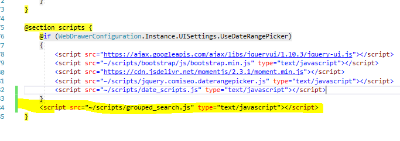

# Group Search Clauses in WebDrawer

## Overview
The WebDrawer search form allows you to specify three search clauses and seperate them with either AND or OR boolean operators.  What it does not allow for is explicit grouping, so you will not be sure whether the first two clauses will be evaluated together or th last two..

This sample allows parentheses to be added to the search string and also displays the search string so you can know exactly what search will happen before pressing search.


## Installing the sample

To install from the files here:
  * copy grouped_search.js to your WebDrawer 'scripts' folder
  * in Views\Search.cshtml add `<script src="~/scripts/grouped_search.js" type="text/javascript"></script>` to the scripts section (see image 1 below)


 
 
## Add custom elements to search page
In the file Views\Shared\SearchForm.cshtml add the following HTML before the 'Sort By' heading
```
    <label class="checkbox inline"><input type="checkbox" id="exact-string-searches" checked /> @Translations.lang.search_search_exact</label>

    <div>
        <label class="radio inline"><input type="radio" name="clause-grouping" id="group-first-two" checked /> Group first two </label>
        <label class="radio inline"> <input type="radio" name="clause-grouping" id="group-last-two" /> Group last two</label>
    </div>

    <div style="margin-top:10px">Search query: <em id="sampleQuery"></em></div>
```
