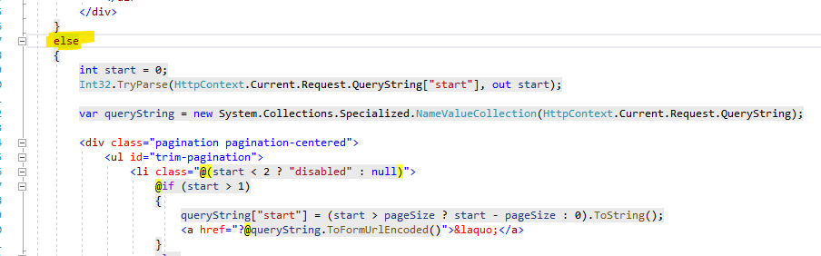

# Infinite scroll for WebDrawer

## Overview
WebDrawer uses a simple pagination model to retrieve subsequent pages from a search response.  This sample adds an infinite scroll for the Record search.


## Installing the sample
Copy the file Views\Shared\custom_scripts.cshtml to the Views\Shared folder in your WebDrawer installation.

## Optimising performance
Since the page numbering is no longer required you may choose to optimise the searching, this can be done by setting resultsOnly to true in the Records route.

```
    <add
      name="Record"
      model="Records"
      resultsOnly="true"
      template="WDRecordList" 
      stringDisplayType="TreeColumn"
      properties="RecordRecordType,RecordExtension,RecordTitle,RecordNumber,RecordIsElectronic"
    />
```

## Hiding the page number
If you have optimised the search the page number and 'Get Count' button will still be displayed at the bottom of the page, you may choose to hide these, to do this:
 1) edit the file Views\Shared\searchResults.cshtml, and
 2) add the code 'if (!(this.Request.Dto is HP.HPTRIM.ServiceModel.Records))' after the else statement that surrounds the page number code.
 
### Before
  
  
### Before
  
  
## A modification for 94 and before
This sample was built in CM 10, which has changed the way icons are handled.  If you look in custom_scripts.cshtml you will see the icon IMG HTML like this: 

```

```

In 94 and earlier versions it should look like this:

```

```